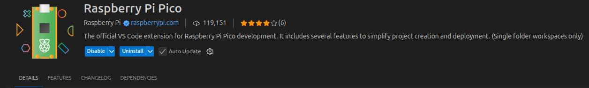

Firmware User Guide
==================================

Welcome to the firmware user guide. Before diving into setup instructions, it's important to understand the purpose of this firmware.This firmware is designed to control a Pressure Rig that delivers a specified pressure (in PSI) to an actuator. It allows us to programmatically control our hardware. 

Pico Set-Up
--------------
The microcontroller we use is the Raspberry Pi Pico. If you’ve never used the pico before here are some great starting resources and tutorials. 

`Raspberry Pi Pico Datasheet <https://datasheets.raspberrypi.com/pico/getting-started-with-pico.pdf>`_

`How to setup Pico sdk on your system <https://www.raspberrypi.com/documentation/microcontrollers/c_sdk.html>`_

`Beginner Tutorial Video (Windows Setup) <https://www.youtube.com/watch?v=L03jT5slWnw>`_

Github Set-Up
-------------
Now that you've set up the Raspberry Pi Pico SDK on your machine and have verified that it's working, you're ready to install and build the firmware we've developed.

Step 1: Clone the repository 
^^^^^^^^^^^^^^^^^^^^^^^^^^^^

``git clone git@github.com:CooperUnionBIRDLab/Single_Regulator_Firmware.git``

Step 2: Understanding the repo
^^^^^^^^^^^^^^^^^^^^^^^^^^^^^^
You should see the following directory structure 

.. code-block:: text

   pressure_rig_firmware/
   ├── CMakeLists.txt
   ├── README.md
   └── pressure_rig_16.cpp
 
Here is a breakdown of each file

**CMakeLists.txt**: Defines the project, its dependencies, and how it should be built using CMake.

**pressure_rig_16.cpp**: Contains the core firmware code that runs on the Raspberry Pi Pico and interfaces directly with the Pressure Rig hardware.

VS Code Extension Instructions 
------------------------------
In VsCode install the Raspberry Pi Pico Extension 

Click on the extension and press **Import Project**

Locate the repostory we cloned earlier and set the Pico SDK Version to v1.5.1

Then once everything is loaded go back and press **Run Project**

Command Line Instructions
------------------------------
Once you have cloned the repository and explored the project structure, follow the steps below to build and install the firmware.

1. **Create the build folder**

   Inside the root directory of the project, run:

   .. code-block:: bash

      mkdir -p build && cd build

2. **Generate build files with CMake**

   Inside the `build/` directory, run:

   .. code-block:: bash

      cmake ..

3. **Compile the firmware**

   If the CMake step succeeds, build the project with:

   .. code-block:: bash

      make

4. **Flash the firmware to the Pico**

   After compiling, put your Raspberry Pi Pico into boot mode. Then either:

   - Drag and drop the newly generated `.uf2` file onto the Pico's USB drive.
   - Or use the following command (replace `[command goes here]` with the actual command):

     .. code-block:: bash

        [command goes here]

5. **Finish installation**

   Once the `.uf2` file is copied, disconnect the Pico from the computer. The firmware should now be running.

