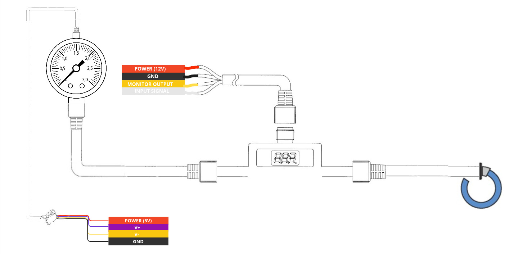

Hardware User Guide
=================

Assembly Overview
-------

`Code Block`

PCB Layout:
^^^^^^

Block Diagram: 
^^^^^^

For example:
^^^^^^

How Do You Start a Test?
------

BEFORE YOU START A TEST, PLEASE READ THROUGH THE :ref:`dangers` SECTION!

How Do You End a Test?
------
