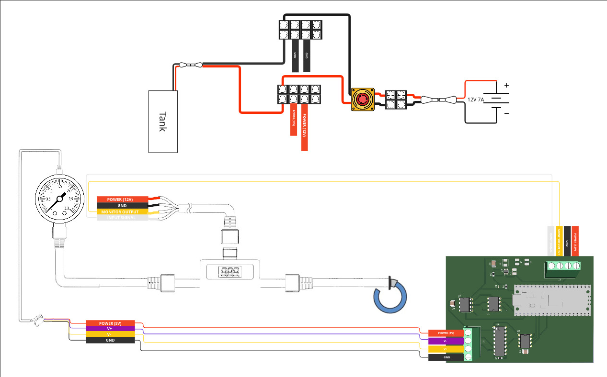

Hardware User Guide
=================
Block Diagram: 
^^^^^^

Power Switch:
-------------
Show image of Switch 1 from Block Diagram →

This switch connects the battery to the system. Only engage this switch when active operation is required.

Tank Switch:
------------
Show image of Switch 2 →

This switch controls tank pressurization. When the system is powered on, activating this switch begins filling the tank with PSI.

Caution: The tank will continue filling until you physically disconnect the switch. Monitor pressure levels during filling.

Estop Button (Emergency Stop):
-----------------------------
Show image of Estop Button →

This is your fail-safe emergency control. If you observe any abnormal behavior, malfunctions, or unsafe conditions, your first action must always be to press this button immediately, regardless of circumstances.

Pressure Regulator Adjustment:
------------------------------
For guidance on using or adjusting the pressure regulator, refer to the manufacturer's instructions here: https://www.smcneumatics.com/pdfs_smc_instructional/ITV-E.pdf
